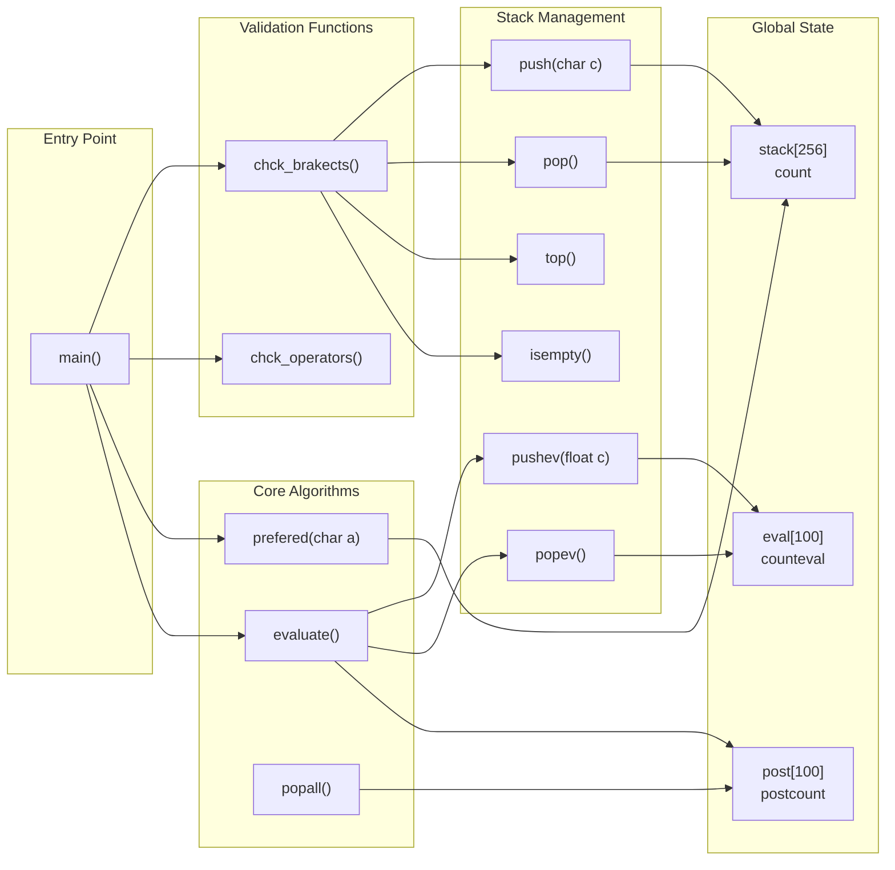

Here's the complete markdown content from the Overview wiki page that you can copy-paste directly into your README:

```markdown
# Overview

This document provides an overview of the Infix Calculator repository, a single-file C implementation that evaluates arithmetic expressions using stack-based algorithms. The system converts infix notation expressions to postfix notation before performing evaluation, demonstrating fundamental data structure concepts including stack operations and expression parsing.

The calculator supports basic arithmetic operations (+, -, *, /, ^) with single-digit operands and handles parentheses for grouping.

## System Purpose and Capabilities

The Infix Calculator implements a three-phase processing pipeline that transforms user-entered mathematical expressions into computed results. The system accepts infix expressions containing single-digit numbers, arithmetic operators, and parentheses, then produces floating-point results with four decimal places of precision.

**Key Capabilities:**
- Infix to postfix expression conversion using the Shunting Yard algorithm
- Postfix expression evaluation using stack-based arithmetic
- Input validation for bracket matching and operator sequences
- Support for operator precedence rules (^, *, /, +, -)
- Interactive command-line interface with error recovery

**Technical Constraints:**
- Single-digit operands only (0-9)
- Fixed-size arrays for stack storage
- No support for decimal input numbers
- Recursive error handling approach

## High-Level System Architecture

The system architecture centers around three primary data structures and a sequential processing pipeline implemented in a single C file.

#### Core Data Structures and Processing Flow

```mermaid
graph TB
    subgraph "Input Processing"
        A["main()"] --> B["gets(inf[100])"]
        B --> C["chck_brakects()"]
        B --> D["chck_operators()"]
    end
    
    subgraph "Global Data Arrays"
        E["stack[256]<br/>Character Stack"] 
        F["post[100]<br/>Postfix Storage"]
        G["eval[100]<br/>Float Stack"]
    end
    
    subgraph "Conversion Engine"
        H["Infix Parser Loop"] --> I["prefered()"]
        I --> J["push()/pop()"]
        J --> K["Postfix Builder"]
    end
    
    subgraph "Evaluation Engine"
        L["evaluate()"] --> M["pushev()/popev()"]
        M --> N["Arithmetic Operations"]
    end
    
    A --> H
    C --> H
    D --> H
    H --> E
    K --> F
    F --> L
    L --> G
    N --> O["printf(\"%.4f\")"]
    
    style A fill:#f9f9f9
    style L fill:#f9f9f9
    style E fill:#f5f5f5
    style F fill:#f5f5f5
    style G fill:#f5f5f5
```

## Code Entity Mapping

The following diagram maps the system's conceptual components to their actual implementation in the codebase:

#### Function and Data Structure Relationships



## Processing Pipeline Overview

The calculator follows a strict sequential processing model where each phase must complete successfully before proceeding to the next:

| Phase | Primary Functions | Input | Output | Error Handling |
|-------|------------------|-------|--------|----------------|
| **Validation** | `chck_brakects()`, `chck_operators()` | `inf[100]` string | Boolean validation result | Recursive `main()` call |
| **Conversion** | `main()` parser loop, `prefered()`, stack ops | Validated infix string | `post[100]` postfix array | N/A (validation ensures success) |
| **Evaluation** | `evaluate()`, `pushev()`, `popev()` | `post[100]` array | `float` result | N/A (well-formed postfix guaranteed) |

The system uses global index counters (`count`, `postcount`, `counteval`) to track the current state of each data structure throughout processing.

**Error Recovery Mechanism:**
When input validation fails, the system prints an error message and recursively calls `main()` to restart the entire process, effectively implementing a simple retry loop without structured exception handling.

## Key Design Characteristics

**Single-File Architecture:** The entire calculator implementation resides in the `Calculator Stack` file, containing all data structures, algorithms, and user interface logic in approximately 210 lines of C code.

**Stack-Centric Design:** The system employs three distinct stack/array structures:
- Character stack (`stack[256]`) for operator precedence management during conversion
- Postfix storage (`post[100]`) as an intermediate representation
- Float stack (`eval[100]`) for arithmetic computation during evaluation

**Global State Management:** All data structures and counters are declared as global variables, simplifying function interfaces but requiring careful state management across the processing pipeline.

**Precedence-Driven Conversion:** The `prefered()` function encodes operator precedence rules (parentheses: -1, +/-: 1, */: 2, ^: 3) that drive the infix-to-postfix conversion algorithm.
```

## Notes

This markdown content is ready to paste directly into your README.md file. The mermaid diagrams will render properly on GitHub, and all the technical documentation provides a comprehensive overview of your calculator's architecture and functionality. You may want to add installation/compilation instructions and usage examples specific to your needs.

Wiki pages you might want to explore:
- [Overview (Zafaranii/Infix-Calculator)](/wiki/Zafaranii/Infix-Calculator#1)
